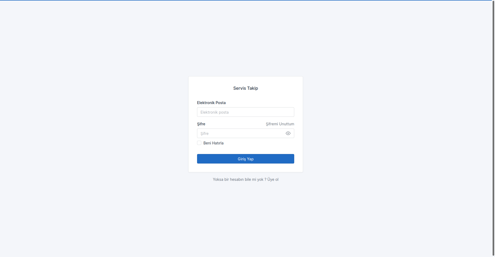
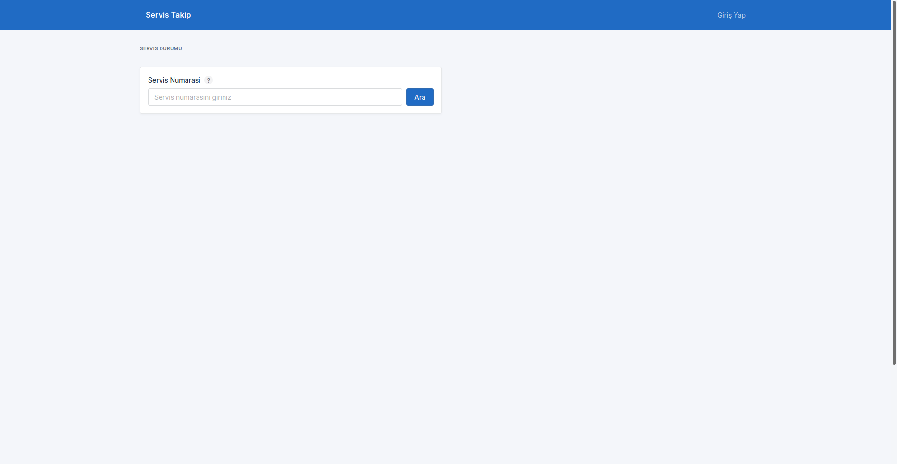
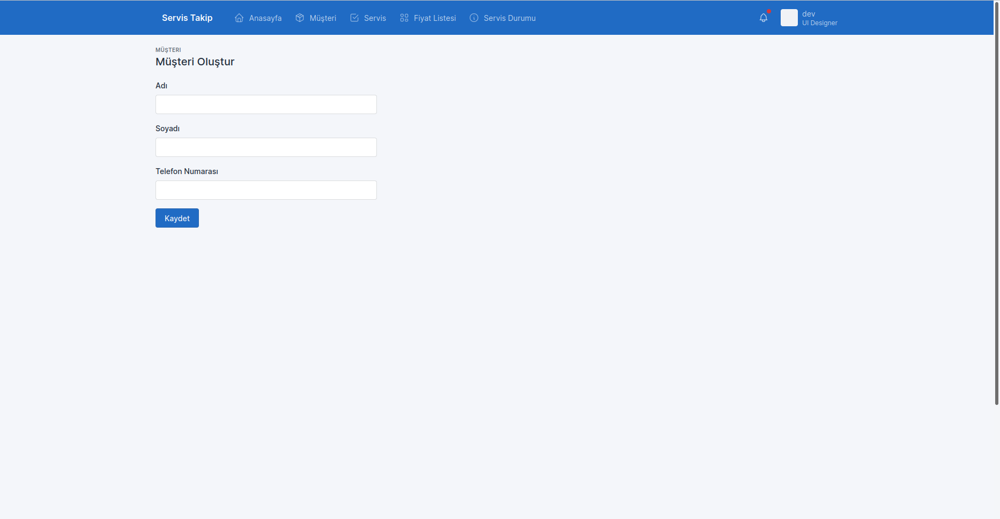
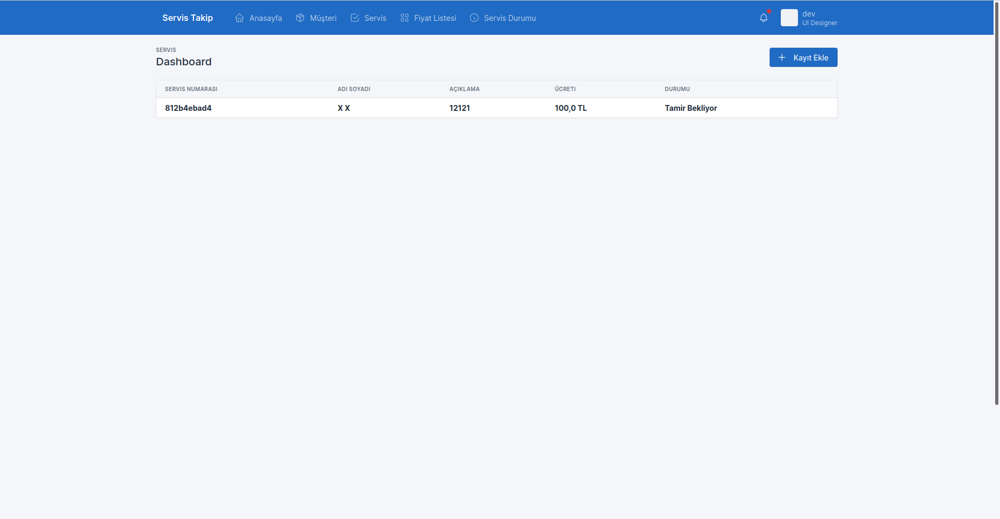
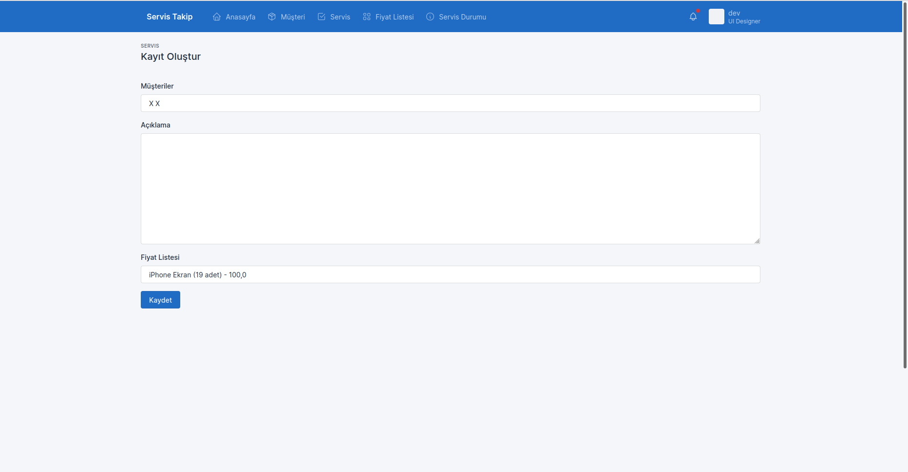
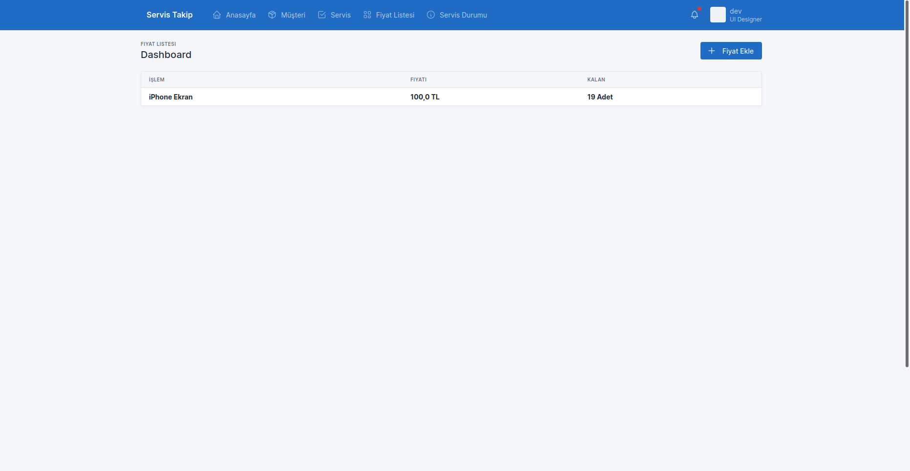
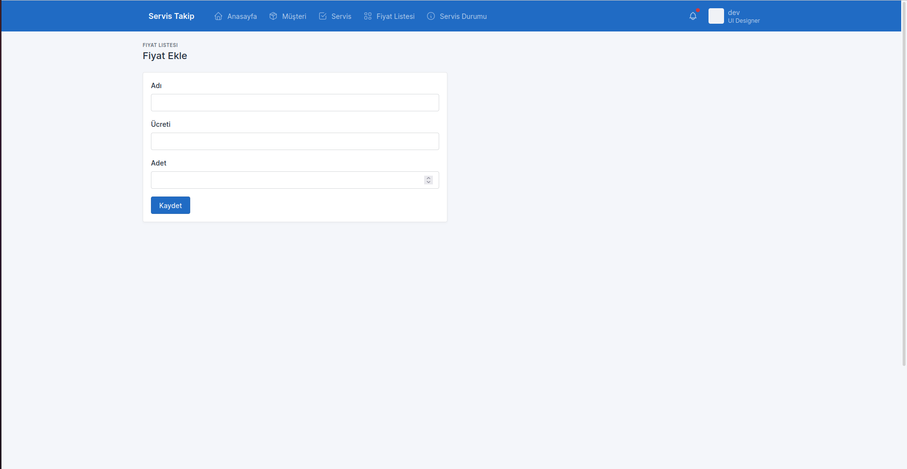

# Serman
The project name is combination words of **ser**(vice) and **man**(agement)

This project is a service management for shops of fixing mobile phones. Also the project helps me improve me

Using **serman** you can manage that
- create users and manage
- define replacement part, amount and price
- create service records 
- manage repaired phone and change status (WAITING, FIXING, FIXED)
- customers can follow phone's repairing status

Screenshots
- Login 

- Customer Screen

- Add Customer Screen

- Service Screen

- Add Service Screen

- Price List Screen

- Add Price List Screen
